# Need For Gaussian Processes

We will be concerning ourselves with the case of supervised learning, in which the aim is to learn a mapping from input to output. Given a training set, the aim is to make predictions on a test point that is not part of the training data, that is we need to move from finite data to a function that gives an output for any possible input value. This can be done by adopting two approaches. In the first approach, we make some underlying assumptions about our hypothesis, like assuming our hypothesis to be linear, or quadratic etc. In simple linear regression, target and input variables can be associated with the equation $$y = f(x) + \epsilon$$, where $$y$$ is the true output, f is the hypothesis, x is the input and $$\epsilon \sim \mathcal{N}(0, \sigma^2)$$ from the central limit theorem as $$\epsilon$$ is assumed to capture unmodeled effects or random noise. If we assume f to be a linear relationship with parameters w0 and w1, then according to Bayesian linear regression, the distribution over parameters will be updated as and when new data points are observed.  In the second approach of Gaussian Process which is a non-parametric approach, a distribution is learned over all possible hypothesis functions that fit the training data. As with all Bayesian methods, it begins with a prior distribution where higher probabilities are given to smooth functions which we consider more likely. This can be seen as imposing a preferential bias as opposed to imposing restrictive bias as in the first approach. A preference bias is an inductive where some hypothesis are preferred over others and a restriction bias is an inductive bias where the set of hypothesis considered is restricted to a smaller set. The distribution over functions is updated as data points are observed, producing the posterior distribution over functions. We make use of covariance matrix due to which the input variables close to each other will output values that are close.  A GP assumes that $$p(f(x_1),…,f(x_N))$$ is jointly Gaussian, with some mean $$\mu (x)$$ and covariance $$\Sigma (x)$$ given by $$\sum_{ij}=k(x_i,x_j)$$, where $$k$$ is a positive definite kernel function, where $$x_1, x_2, ....x_N$$ are training instances.

# Multivariate Gaussian Distribution

A multivariate Gaussian distribution of $$N$$ random variables is defined by a mean vector of size $$N$$ whose $$i^{th}$$ entry contains the mean of probability distribution of $$i^{th}$$ random variable and a covariance matrix $$K$$ such that $$K_{ij}=E[x_i.x_j]$$. Taking the example of bivariate Gaussian  distribution of random variables $$X_1$$ and $$X_2$$, 

{: .center-image }

In case 1, $$X_1$$ and $$X_2$$ are independent of each other whereas in case 2, they are positively correlated. 

{: .center-image }

If we have a joint gaussian distribution of $$N$$ random variables , then the conditional probability of a subset of this $$N$$ random variables will also follow gaussian distribution.

From matrix manipulations it can be proved that for $$P(X_2 \vert X_1 = x_1)$$

$$\mu = \mu_1 + \Sigma_{12}\Sigma^{-1}_{22}(x_2 - \mu_2)$$

$$\Sigma_{12} = \Sigma_{11} - \Sigma_{12}\Sigma_{22}$$

where $$\Sigma_{ij}$$ is equal to correlation between $$X_i$$ and $$X_j$$

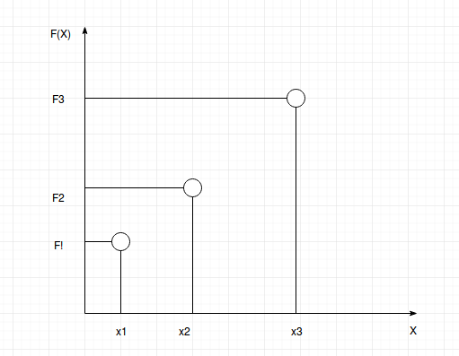{: .center-image }

Let, $$F_1, F_2, F_3$$ be the functions that gives the correct output for training examples $$x_1, x_2, x_3$$ respectvely. It is assumed that $$F_1, F_2, F_3$$ will follow a joint Gaussian distribution and correlation between any 2 functions will be defined by the corresponding entry in the covariance matrix. The entries in the covariance matrix will be filled using some pre-decided kernel.

$$

\begin{bmatrix}
F_1 \\
F_2 \\
F_3
\end{bmatrix} \sim \Bigg(
\begin{bmatrix}
0 \\
0 \\
0
\end{bmatrix},
\begin{bmatrix}
K_{11}  & K_{12} & K_{13} \\
K_{21}  & K_{22} & K_{23} \\
K_{31}  & K_{32} & K_{33}
\end{bmatrix}\Bigg).
$$

The distribution defined by this covariance matrix is prior distribution of functions which will then be modified when training data is observed. For mathematical simplicity the mean function is taken to be zero.

# Kernel Design

The choice of kernel, that is the covariance function determines almost all the generalization properties of a GP model. Therefore according to me choosing the kernel to model the problem is the most important step in gaussian processes. 

### Squared Exponential Kernel

Formula for squared exponential kernel is $$k_{SE} (x,x') = \sigma^2 exp\big( -\frac{(x - x')^2}{2l^2}\big)$$. $$\sigma^2$$ is the scaling parameter and $$l$$ is lengthscale that determines the smoothness of the function.

### Rational Quadratic Kernel

Formula for Rational Quadratic Kernel is $$k_{RQ}(x, x') = \sigma^2\big( 1 + \frac{(x - x')^2}{2al^2}\big)^{-\alpha}$$. This can be seen as a combination of many squared exponential kernels with different lenght scales added together. In this kernel different features of input space affect the smoothness property by different degree. The parameter $$\alpha$$ determines the weightage given to small and large scale variations.

### Periodic Kernel

Formula for Periodic Kernel is $$k_{Per} (x, x') = \sigma^2  exp\big(-\frac{2sin^2(\pi\vert x - x'\vert /p)}{l^2}\big)$$. This kernel is used to determine the covariance matrix of functions which follow repetition. Parameter $$p$$ determines the distance between repetitions and lengthscale $$l$$ determines the smoothness of function.

### Locally Periodic Kernel

Formula for Locally Periodic Kernel is $$k_{LocalPer}(x, x') = k_{Per}(x, x')k_{SE}(x, x') = \sigma^2exp\big(-\frac{2sin^2(\pi\vert x - x'\vert /p)}{l^2}\big)exp\big(-\frac{(x-x')^2}{2l^2}\big)$$. This kernel is for functions which are periodic but vary slowly over time as the distribution of the repeating part of function will change with the addition of squared exponential term.

# Prediction with Noise-free Observations

Let the training dataset be of the form $$\{(x^{(i)},f^{(i)})\vert i = 1,....,n\}$$. The design matrix $$X$$ consisting of all the training inputs will be of the dimension $$D \times n$$, where $$D$$ is dimension of the input space. Let $$f$$ denote the joint distribution of all the hypothesis functions corresponding the elements of the training set. The entries of covariance matrix of $$f$$ will be filled with the use of a kernel. Similarly, the design matrix for test inputs $$\{x^{(i)}_*\}^{n_*}_{i=1}$$ is defined as $$X_*$$.

Let $$f_*$$ be the hypothesis function that gives the output for test inputs. The joint distribution of $$f$$ and $$f_*$$ will be

$$
\begin{bmatrix}
f \\
f_*
\end{bmatrix} \sim \mathcal{N}\bigg(0, 
\begin{bmatrix}
K(X,X)  & K(X,X_*) \\
K(X_*,X)  & K(X_*,X_*)
\end{bmatrix}\bigg).
$$

If there are $$n$$ number of training inputs and $$n_*$$ number of test inputs then

* $$K(X, X)$$ denotes the covariance matrix of distribution $$f$$ with dimension $$n \times n$$.
* $$K(X, X_*)$$ denotes the covariance matrix of test points with training points and has dimension $$n \times n_*$$.
* $$K(X_*, X_*)$$ denotes the covariance matrix of test points with themselves and has dimension $$n_* \times n_*$$.
* The covariance matrix $$K$$ of joint distribution $$f$$ and $$f_*$$ will thus have dimension $$ (n + n_*) \times (n + n_*) $$.

The covariance matrix $$K$$ defines the prior distribution over functions. In-order to obtain the posterior distribution over function this joint distribution will be restricted to only those functions that agree with the observed outputs. 

Now, as discussed before, we can get the distribution of $$f_*$$ given the Posterior distribution of $$f$$ as 

$$f_*\vert X_*,X,f \sim \mathcal{N}(K(X_*,X)K(X,X)^{-1}f,K(X_*,X_*)-K(X,X)^{-1}K(X,X_*)).$$

The mean of distribution of $$f_*$$ will be the output given for corresponding test points and the variance will tell how confident we are about the predictions. Small variance will represent more confidence while high variance will represent low confidence.

# Prediction using noisy observations

In Gaussian Process modeling, the covariance kernel chosen defines the prior distribution over functions. But this is not sufficient as the aim is that the hypothesis function can give the output for test points that the model has not yet seen. 

So far in the tutorial, the assumption has been that the Gaussian process model is noise free, that is the hypothesis functions didn't have noise and thereby always gave the true value as output for the input in the training set. But now the model will be taking unmodeled effects and random noise into account which can be represented by $$\epsilon$$. $$\epsilon$$ is now $$IID$$ according to a Gaussian distribution.
So now the function of evaluation will be noisy.

$$y = f(x) + \epsilon, where \> \epsilon \sim \mathcal{N} (0, \sigma ^2_y)$$

In order to compute the $$P(y\vert X)$$ we need to integrate over $$f$$.

$$p(y \vert X) = \int p(y \vert f,X)p(f \vert X)df$$

$$p(f \vert X) = \mathcal{N} (f \vert 0,K)$$

Since all the data points are independent,  

$$p(y \vert f) = \prod_i\mathcal{N} (y_i \vert f_i,\sigma ^2_y)$$

Then, according to convolution theorem, 

$$cov[y \vert X] = K + \sigma ^2_yI_N \triangleq K_y $$

This shows that the distribution of the noisy function still has the same mean 0 but its covariance increases, i.e. we become less confident of the predictions.

Earlier when the training data was noise free, then the uncertainty collapsed where there was data but now even where there is data, it is assumed that there will be an uncertainty of at least up to $$\sigma ^2_y$$. The earlier property also still holds that where there is data, there less uncertainty is there and vice versa.

So now the joint distribution of observed target values and the function values at test inputs under the prior will be 

$$
\begin{bmatrix}
y \\
f_*
\end{bmatrix} \sim \mathcal{N}\bigg(0, 
\begin{bmatrix}
K(X,X) + \sigma ^2_yI  & K(X,X_*) \\
K(X_*,X)  & K(X_*,X_*)
\end{bmatrix}\bigg).
$$

Therefore, the conditional distribution of $$f_*$$ will be 

$$f_*\vert X,y,X_* \sim \mathcal{N}(\hat{f_*},cov(f_*)),$$ where
$$\hat{f_*} \triangleq  E[f_*\vert X,y,X_*] = K(X_*,X)[K(X,X) + \sigma ^2_yI]^{-1}y,$$

$$cov(f_*) = K(X_*,X_*) - K(X_*,X)[K(X,X)+\sigma ^2_yI]^{-1}K(X,X_*).$$

# Gaussian Process Modeling

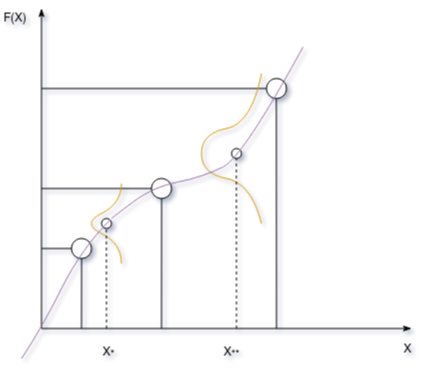{: .center-image }

From the diagram it can be seen that for test point $$X_*$$ we more confident about the output that we have predicted for it. Whereas for test point $$X_{**}$$ we are less confident. The output will be the mean of the distribution for each test point.

Since a function is just a mapping from input to output. In the figure the purple line can be thought as a function that takes the input $$X$$ and returns mean and covariance of distribution of hypothesis function $$F(X)$$ of $$X$$. Now, since there can be infinite inputs in the input space and for each input there will be a distribution of $$F(X)$$ that will give the output for it, these infinite number of functions will constitute a joint multivariate Gaussian distribution as they will be correlated.

Therefore a GP is a generalization of a Gaussian distribution to infinite dimensionality.

Let real process f(x) be distributed by GP with mean m(x) and covariance k:

$$f(x) \sim GP(m(x), k(x,x'))$$

$$m(x) = E[f(x)]$$

$$k(x,x')=E[(f(x) - m(x))(f(x') - m(x'))]$$

$$k(x,x')=cov[f(x),f(x')]$$ 

# Deep Gaussian Process

Neural Networks can learn very complex mappings from the inputs to outputs. When data is combined with any model, then that requires a predictive function and an objective function to define the cost of misprediction. Now uncertainty in prediction can arise from the scarcity of training data, a mismatch between the set of prediction functions chosen to define the model versus all possible prediction functions and uncertainties in the objective function. This tutorial will deal with the uncertainties that arise due to the choice of prediction functions. 
Considering the case of neural network with 1 hidden layer, let 

$$f(x) = w^{(2)^T}\phi (W_1, x)$$

Here, 
* $$f(x)$$ is a scalar function with vector inputs
* $$\phi$$ is an activation vector function with vector inputs
* Elements of $$W_1$$ are the parameters of first hidden layer. with dimensions of $$W_1$$ being $$d \times h$$. Where $$d$$ is the dimension of input and $$h$$ is the dimension of the hidden layer.
* $$w^{(2)}$$ is a $$h \times 1$$ dimensional vector which maps the output of hidden layer to a scalar output

According to the properties of univariate gaussian,

* Sum of Gaussian variables is also Gaussian. 

$$z_i \sim \mathcal{N}(\mu _i, \sigma ^2_i)$$

$$\sum ^n_{i=1} z_i \sim \mathcal{N}\bigg(\sum ^n_{i=1} \mu _i, \sum ^n_{i=1}\sigma ^2_i\bigg)$$

* Scaling a Gaussian leads to a Gaussian

$$ z \sim \mathcal{N}(\mu, \sigma^2)$$

$$ v \sim \mathcal{N}(v\mu, v^2\sigma^2)$$

Now by keeping $$W_1$$ fixed,

Let $$x \sim \mathcal{N}(\mu , \Sigma)$$ Where $$\mathcal{N}(\mu , \Sigma)$$ defines $$P(x)$$.

$$y = W*x$$ which defines $$P(y\vert x)$$.

Then we get $$y \sim \mathcal{N}(w\mu, w\Sigma w^T)$$ where $$\mathcal{N}(w\mu, w\Sigma w^T)$$ defines $$P(y)$$.

As is observed that due to the properties of Gaussian processes it is trivial to calculate the marginal and joint distributions which otherwise would have included complex mathematical integration.

Let, $$\phi _{ij} = \phi (w^{(1)}_j, x_i)$$ where $$x_i$$ is $$i^{th}$$ data point and $$w^{(1)}_j$$ is the $$d \times 1$$ dimensional weight associated with $$j^{th}$$ hidden unit.

So, the designed matrix obtained is 

$$\begin{bmatrix}
\phi_{(1,1)}  & \phi_{(1,2)} & \dots & \phi_{(1,h)} \\
\phi_{(2,1)}  & \phi_{(2,2)} & \dots & \phi_{(2,h)} \\
\vdots & \vdots & \ddots & \vdots \\
\phi_{(n,1)}  & \phi_{(n,2)} & \dots & \phi_{(n,h)} \\
\end{bmatrix}$$

Now, representing the output of neural network in matrix form,

$$ y = \phi w + \epsilon \> where \> \epsilon \sim \mathcal{N}(0,\sigma^2)$$.

* $$y$$ is a $$n \times 1$$ dimensional vector
* $$\phi$$ is a $$n \times h$$ dimensional matrix
* $$w$$ is a $$h \times 1$$ dimensional vector
* $$\epsilon$$ is a $$n \times 1$$ dimensional vector

Now, let a probability distribution be defined over parameter set $$w$$.

$$w \sim \mathcal{N}(0, \alpha I)$$

Then, according to rules of multivariate Gaussian distribution.

$$y \sim \mathcal{N}(0, \alpha \phi \phi^T + \sigma^2 I)$$

The covariance function will be formed by inner products of rows of design matrix.

$$k_f(x_i,x_j) = \alpha \phi (W_1, x_i)^T\phi (W_1, x_j)$$

# Priors for Infinite Networks

Theoritically, an infinite neural network i.e. Neural network that has infinite number of hidden layer units can reasonably be a non-parametric model since it will be able to learn very complex functions which maps inputs to outputs. It turns out that we can define priors for functions represented by hidden units if we define suitable priors for weights depending on the application. In practise the network will have sufficiently large finite number of hidden units which has characteristics close to that of an infinite network. 

$$f_k(x) = b_k + \sum ^H_{j=1}v_{jk}h_j(x)$$

$$h_j(x) = tanh\big(a_j + \sum ^I_{i=1}u_{ij}x_i\big)$$

Here,
* $$u_{ij}$$ is the weights for computing the hidden layers outputs, $$x_i$$ is the $$i^{th}$$ input instance, $$a_j$$ is the bias applied on the hidden layer units, $$h_j$$ is the output of the $$j^{th}$$ hidden unit. $$tanh$$ is the acitvation function
* Similarly, $$v_{jk}$$ is the weights applied on the output from hidden layer $$h_j$$, $$b_k$$ is the bias and $$f_k$$ is the output of the $$k^{th}$$ unit.

The hidden to output weights, $$v_{jk}$$, output biases $$b_k$$, input to hidden weights $$u_{ij}$$ and hidden unit biases $$a_j$$ have Gaussian distributions with mean 0 and standard deviations $$\sigma_v$$, $$\sigma_b$$, $$\sigma_u$$ and $$\sigma_a$$ respectively.

* The expected value of each hidden unit's contribution in calculation of $$f_k(x^{(1)})$$ is 0.
$$E[v_{jk}h_j(x^{(1)})] = E[v_{jk}]E[h_j(x^{(1)})] = 0$$ Since, $$E[v_{jk}]$$ is 0 by hypothesis.
* Variance of contribution of each hidden unit is finite
$$E[(v_{jk}h_j(x^{(1)})^2)] = E[v^2_{jk}]E[h_j(x^{(1)})^2] = \sigma^2_vE[h_j(x^{(1)})^2]$$ because output of hidden unit is bounded.
* According to central limit theorem, for large $$H$$, Total contribution of hidden units to calculate $$f_k(x^{(1)})$$ becomes gaussian and has variance $$H\sigma^2_vV(x^{(1)})$$. 
* Prior distribution of $$f_k(x^{(1)})$$ has variance $$\sigma^2_b + H\sigma^2_vV(x^{(1)})$$.
* Theoretically when number of hidden units tend to infinity, then we can set $$\sigma_v = w_vH^{\frac{-1}{2}}$$ for some fixed $$w_v$$.
The prior for $$f_k(x^{(1)})$$ then has mean 0 and variance $$\sigma^2_b + w^2_vV(x^{(1)})$$
* we can thus obtain multi-variate joint distribution of $$f_k(x^{(1)}), ...., f_k(x^{(n)})$$ with mean 0 and each entry in covariance matrix defined as 
$$E[f_x(x^{(p)})f_k(x^{(q)})] = \sigma^2_b + \sum_j \sigma^2_vE[h_j(x^{(p)})h_j(x^{(q)})]$$
$$E[f_x(x^{(p)})f_k(x^{(q)})] = \sigma^2_b + w^2_vC(x^{(p)},x^{(q)})$$
where $$C(x^{(p)},x^{(q)}) = E[h_j(x^{(p)})h_j(x^{(q)})]$$

# Experiments

### Effect of Kernel width parameter and visualization of prior and posterior distribution samples. 

Low value of kernel width parameter tells that we only want to be similar to things that are close by and vice-versa. so when $$l^2$$ is small, we get a wiggly function as opposed to when $$l^2$$ is large, we get a smooth function. In the plots the true function is red and the predictions are in blue.

* For $$l^2 = 0.1$$ the results are as follows

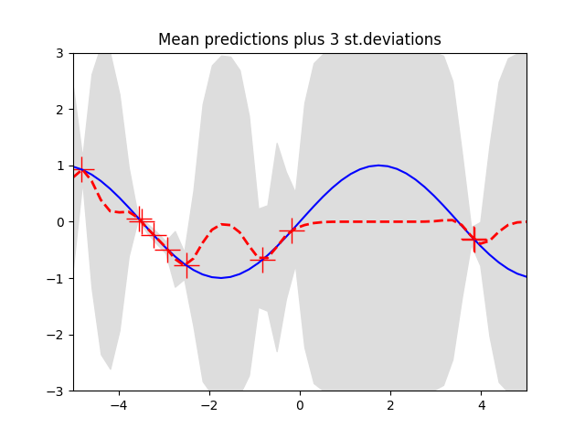{: .center-image }  |  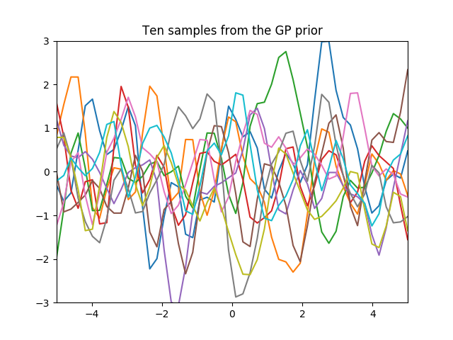{: .center-image }  |  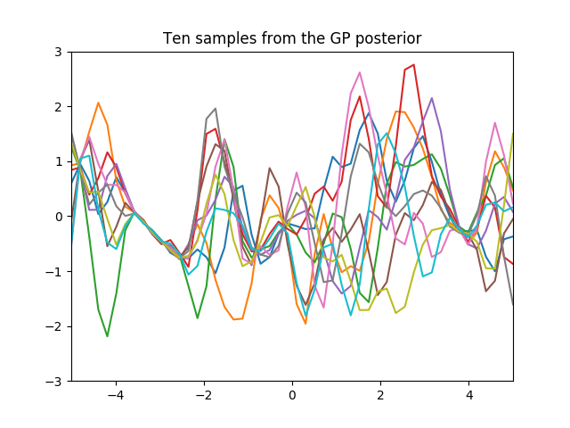{: .center-image }

* For $$l^2 = 1$$ the results are as follows

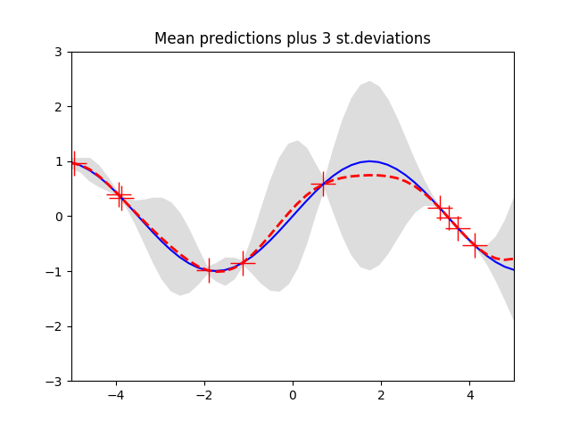{: .center-image }  |  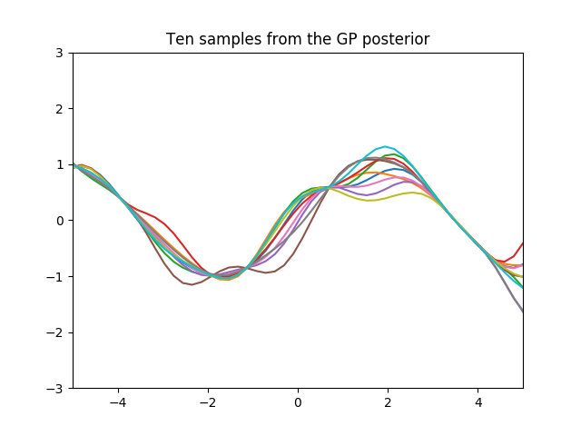{: .center-image }  |  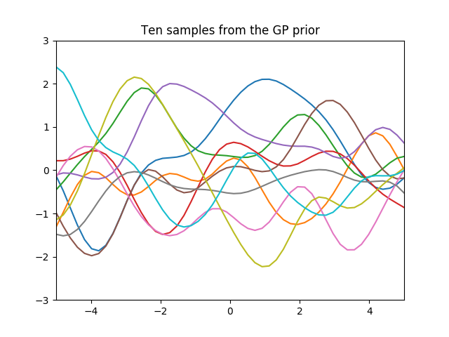{: .center-image }

* For $$l^2 = 10$$ the results are as follows

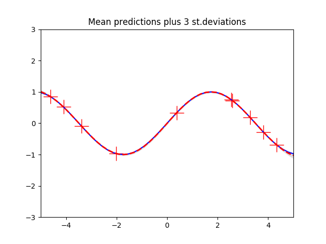{: .center-image }  |  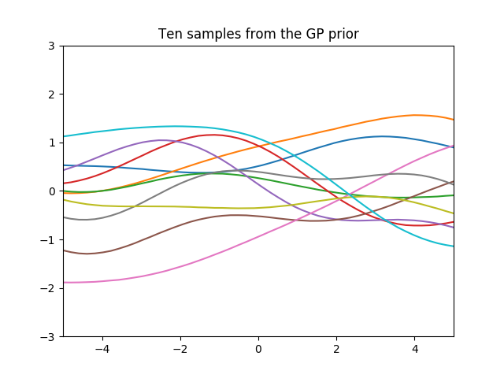{: .center-image }  |  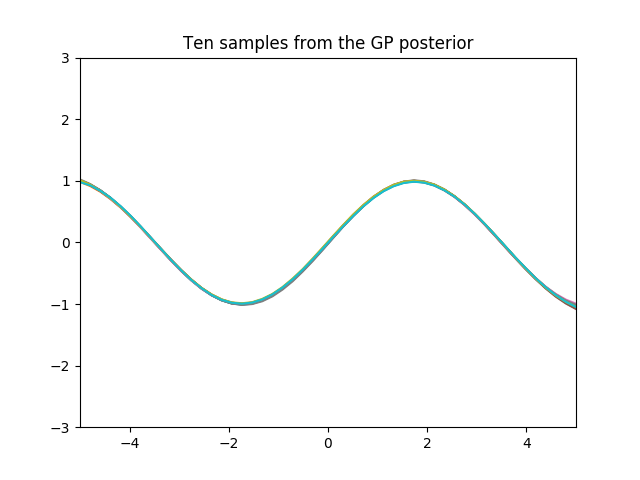{: .center-image }

### Comparison of Gaussian process regression and Linear Regression. 

In this experiment linear regression was performed on the abelone dataset provided by stanford and stored the Mean Squared Error. This MSE of linear regression was then compared with the results of Gaussian process regression. The hyper parameters for the Gaussian process regression was obtained by performing a grid search. Finally Gaussian process regression performed better then linear regression on a particular choice of hyperparameter.

$$ Gaussian Process Regression (MSE) = 4.703 $$

$$ Linear Regression (MSE) = 4.988 $$ 

In the table below results of Gaussian Process regression with different sigma and L parameters are represented.

| sigma      | L parameter   | GPR   | LR    |
|:-----------|:--------------|:------|:------|
| 21.947     | 11.473        | 4.703 | 4.988 |
| 32.421     | 21.947        | 4.812 | 4.988 |
| 105.736    | 63.842        | 4.893 | 4.988 |
| 53.368     | 116.21        | 5.000 | 4.988 |
| 42.894     | 158.105       | 5.131 | 4.988 |
| 11.473     | 200           | 6.012 | 4.988 |
| 1          | 32.421        | 6.638 | 4.988 |
| 1          | 1             | 7.39  | 4.988 |
| 189.526    | 1             | 45.846| 4.988 |

### Comparison of Gaussian process classification and Logistic Regression

In this experiment logistic regression was performed on the Iris Dataset and accuracy was computed. This accuracy of Logistic regression was then compared with the accuracy obtained by Gaussian process classification on the same dataset. The results obtained are as following

$$ Gaussian Process Classification (Accuracy) = 98\%$$

$$ Logistic Regression (Accuracy) = 97\%$$

# References

[Neil Lawrence: Introduction to Gaussian Processess](https://www.youtube.com/watch?v=ewJ3AxKclOg&t=3118s)

[Intermediate Statistics Course](http://www.stat.cmu.edu/~larry/=stat705/)

[Gaussian Processes for Machine Learning ](http://www.gaussianprocess.org/gpml/chapters/RW.pdf)

[Gaussian Process Summer School](http://ml.dcs.shef.ac.uk/gpss/gpws14/)

[Deep Neural Networks as Gaussian Processes](https://arxiv.org/pdf/1711.00165.pdf)
